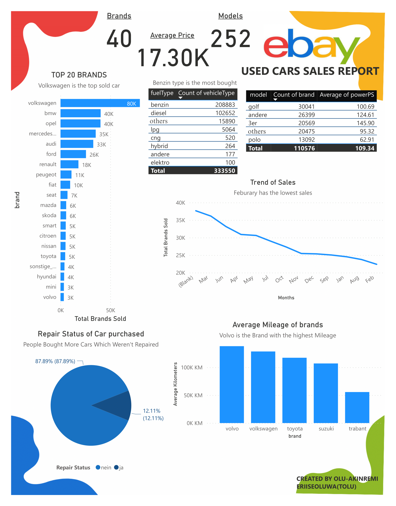

# eBay used cars sales report

Tags: Automotive, E-commerce, Market Analysis, Sales Analytics

Tools Used: EXCEL, POWERBI

Date: April 11, 2024 → April 11, 2024

Project Overview: This project looked at used car sales on eBay to understand what makes some cars sell faster and for better prices. Many sellers struggle because they don’t know what buyers really want things like brand, fuel type, repair history, or mileage can make a big difference.
My goal was to analyze the sales data to uncover patterns and insights that could help sellers make smarter decisions when listing their cars. For example, which brands are most popular, which fuel types sell best, and whether cars that haven’t been repaired sell faster.

Business problem/Problem Statement: Many eBay sellers list cars without understanding what buyers actually care about, leading to slow sales, poor visibility, and missed opportunities. One seller even said:“My car has been up for weeks, but the one next to mine sold in two days.”
Questions sellers and dealerships wanted answered:
• Why do some used cars sell faster than others?
• Does brand, price, or fuel type influence buyer decisions?
• Do repair history or mileage affect sales?
• Which models or features attract the most buyers?

Description of Approach: To figure out what makes used cars sell faster and at better prices on eBay, I followed these steps:
1. Collected the Data: I gathered all the available listings information, including brand, fuel type, car condition, mileage, and sales dates.
2. Cleaned the Data: The dataset was in German, so I had to learn terms like “benzin” (petrol) and “ja/nein” (yes/no). I also removed duplicates and made sure everything was consistent.
3. Explored the Data: Looked for trends like which brands sold the most, which fuel types were preferred, and which months had higher or lower sales.
4. Analyzed the Data: Used Excel and Power BI to create charts and tables that showed patterns and helped compare different cars, fuel types, and months.
5. Faced Challenges: Translating the German labels was tricky and slowed things down. Some fields were easy to misinterpret, so extra care was needed during cleaning.
6. Generated Insights: Found top-selling brands, fuel preferences, car conditions, and seasonal trends that influence sales.
7. Made Recommendations: Suggested ways sellers could improve listings, like highlighting popular models, being transparent about repairs, and planning promotions during slow months.

Status: Done

### **Key Insights**

- **Volkswagen leads massively**, with 80K+ cars sold—double any other brand.
- **Benzin (petrol)** dominates as the top fuel type.
- A whopping **87.89% of sold cars were not repaired**, meaning people prefer untouched or cheaper options.
- **BMW 3er (3 Series)** has the highest average power (145.90 PS), making it the "performance baddie" of the bunch.
- **February saw the lowest sales**, suggesting seasonality effects.
- **Volvo has the highest mileage**, potentially reflecting high durability or lower resale value due to wear.

### **Recommendations**

1. **Highlight best-selling and high-performance models** in listings (e.g. VW Golf, BMW 3er).
2. **Use February for discounts or promotions** to boost sales during the slowest month.
3. **Push for repair transparency** in listings to build trust, especially since the majority of sold cars were “unrepaired”.
4. **Group mileage into categories** to avoid skew from high-mileage outliers like Volvo.
